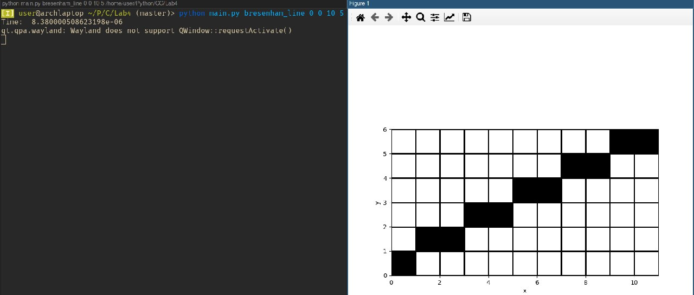
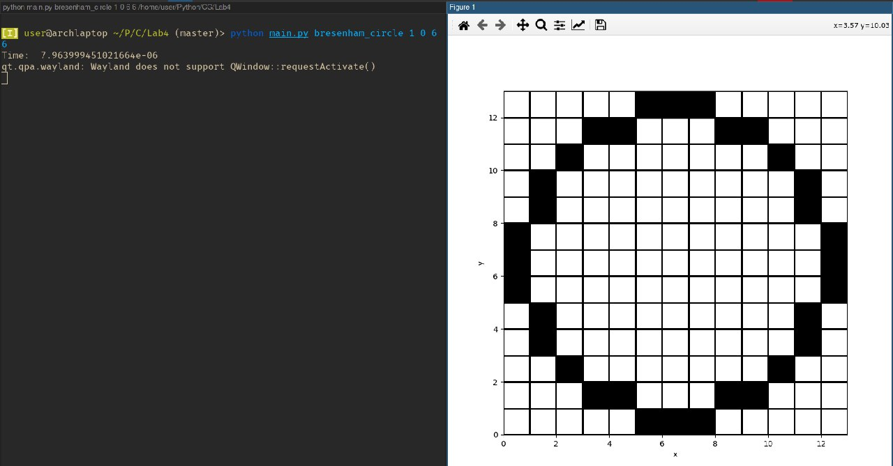

# Лабораторная работа №4. Растеризация отрезков, Кривых
Пошаговый алгоритм, алгоритм ЦДА, Брезенхема для прямой, окружности
## Пример использования
### Растеризация прямых
x0, y0, x1, y1 - координаты двух точек прямой для растеризации
Пошаговый алгоритм:
```
python main.py step_line x0 y0 x1 y1
```
алгоритм ЦДА:
```
python main.py dda_line x0 y0 x1 y1
```
алгоритм Брезенхема:
```
python main.py bresenham_line x0 y0 x1 y1
```
Результат работы любого из алгоритмов:

### Растеризация окружности
x0, y0 - координаты центра окружности, r - радиус
```
python main.py bresenham_circle x0 y0 r 
```

